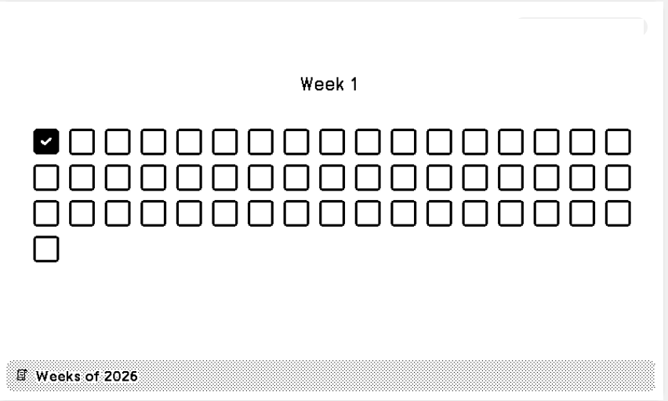
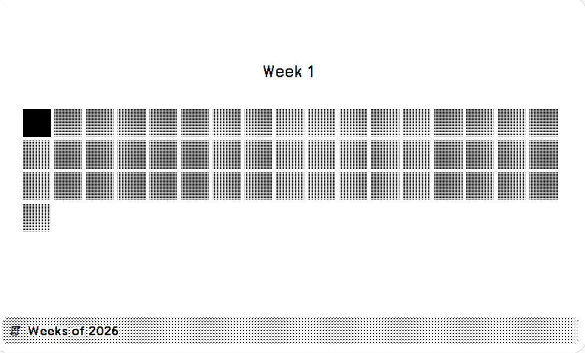

# Weeks of the Year

Displays the week number and a graphical representation of the weeks in a year.

Screenshot Examples:





## Install

You can go to the following link to install this recipe: https://usetrmnl.com/recipes/209377/install
Or you can copy the files from the `src` folder zip it and add it manually.

## Views

| View            | File                     | Description                               |
| --------------- | ------------------------ | ----------------------------------------- |
| Full            | `full.liquid`            | Full screen display                       |
| Half Horizontal | `half_horizontal.liquid` | Half screen, landscape                    |
| Half Vertical   | `half_vertical.liquid`   | Half screen, portrait                     |
| Quadrant        | `quadrant.liquid`        | Quarter screen                            |
| Shared          | `shared.liquid`          | Contains shared variables for all screens |

## Features

- Displays the current week number of the year.
- Graphical representation of all 52 weeks.
- Display an icon or a box for each week.
- The start day of the week can be configured (Sunday or Monday).

## Local Development

First, start the docker development server:

```bash
docker-compose up -d
```

Then, you can edit the files in the `src` folder and see the changes reflected in your browser: http://localhost:8001

## License

